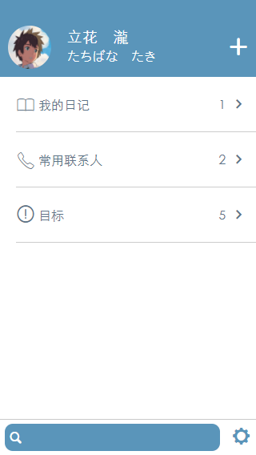

# my-diary-vue   
   
[中文](README.md)        
## Introduction
This app comes from a popular and high-quality Japanese animated film [Your Name](https://en.wikipedia.org/wiki/Your_Name)      
I like the diary application very much,so I copied [the app](https://github.com/ssshooter/MyDiary) immediately with jquery                
After that, I learned Vue for a while, and familiar gradually, and I want to know more about the Vue ecosystem        
After reading some guide in official site, there is still something difficult to understand           
So I decided to refactor Mydiary       
The front and back ends of the project are separated             
back-end: RESTful API([MyDiary API](https://github.com/ssshooter/MyDiary-API)) implemented with nodejs and express    
database: mongoDB        
font-end: vue2 / vuex / vue-router / webpack / ES6  / less       
## Features
- contact
- todolist
- diary
- calendar
## todo
- [x] login page
- [x] register page
- [x] setting page
- [ ] search function
- [ ] database optimization
- [ ] diary pagination
- [ ] exchange diary
- [ ] PWA
## screenshot    
use fireshot      



## Development
This project can be used as personal cloud note
**please install node.js and mongoDB first**   
**please deploy [MyDiary API](https://github.com/ssshooter/MyDiary-API) before use MyDiary**
``` bash
# install dependencies
npm install

# serve with hot reload at localhost:8080
npm run dev

# build for production with minification
npm run build
```

## PS
**my code is not very well, please remind me in the issues**    
and BD is Coming soon!!  17.7.26
