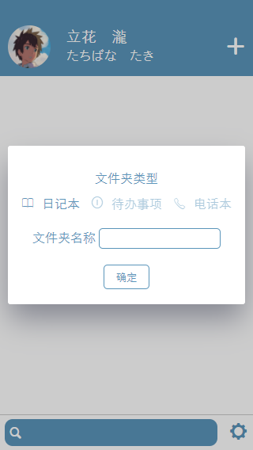
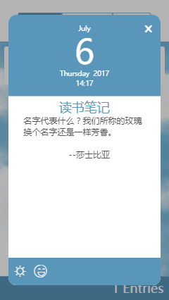
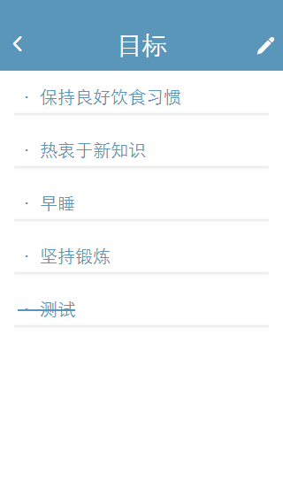
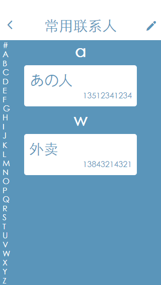

# my-diary-vue   
## 简介
这个应用出自一部（曾经）很火的动画电影，这个电影的水平还是和人气成正比的    
看电影的时候注意到这个日记应用，忍不住立刻[仿了一个](https://github.com/ssshooter/MyDiary)，那时候用的是jquery             
之后，学Vue也有一段时间，浏览器端用得还算熟练，开始想更了解Vue的生态系统        
看完了各种资料后，觉得难懂的地方还是必须从实践中理解，于是再次想起了MyDiary        
这个项目前后端分离，后端使用nodejs和express实现RESTful API（[MyDiary API](https://github.com/ssshooter/MyDiary-API)）    
数据库选择了mongoDB，由于对数据库不太熟悉，数据库构建还是有所欠缺        
前端使用了vue全家桶，使用webpack进行打包    
## 技术栈    
vue2 / vuex / vue-router / webpack / ES6  / less     
## 主要功能
- 电话本，有搜索功能，有侧边栏的字母索引
- 代办事项，可以新添、删除事项，划线表示完成
- 笔记本功能，有搜索功能可
- 可翻页小日历
## todo
- [ ] 搜索功能待完成
- [ ] 数据库结构优化
- [ ] 登陆界面
- [ ] 交换日记
- [ ] 十分遥远的下一个目标，重构为PWA
## 界面截图 







## Build Setup
**请先安装MyDiary API**
``` bash
# install dependencies
npm install

# serve with hot reload at localhost:8080
npm run dev

# build for production with minification
npm run build
```
